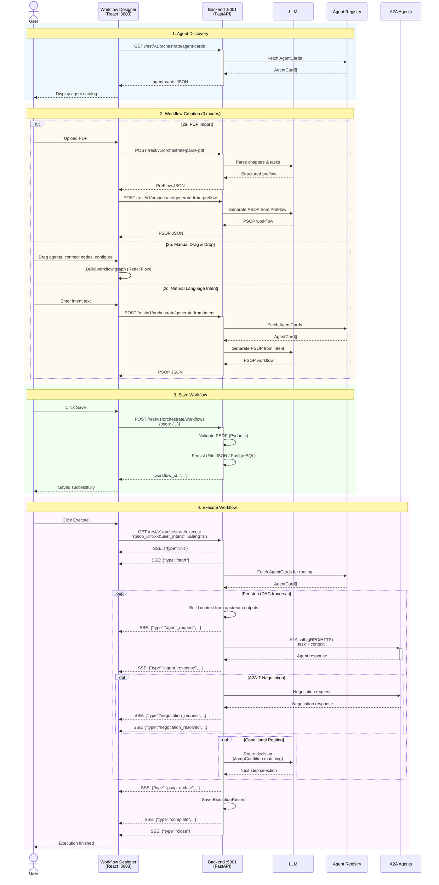
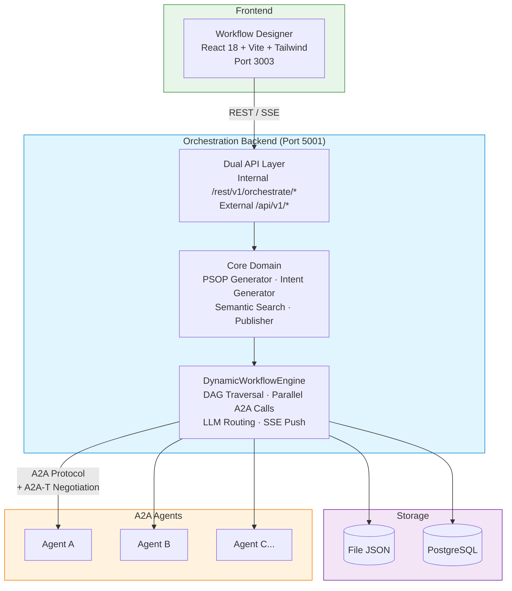

<!--
Copyright (c) 2026 Huawei Technologies Co., Ltd.
All Rights Reserved.

SPDX-License-Identifier: Apache-2.0

   Licensed under the Apache License, Version 2.0 (the "License"); you may
   not use this file except in compliance with the License. You may obtain
   a copy of the License at

        http://www.apache.org/licenses/LICENSE-2.0

   Unless required by applicable law or agreed to in writing, software
   distributed under the License is distributed on an "AS IS" BASIS, WITHOUT
   WARRANTIES OR CONDITIONS OF ANY KIND, either express or implied. See the
   License for the specific language governing permissions and limitations
   under the License.
-->

# A2A-T Multi-Agent Orchestration Center

<p align="center">
  <a href="https://www.python.org/"></a>
  <a href="https://nodejs.org/"></a>
  <a href="LICENSE"></a>
</p>

<p align="center">
  <strong>A visual orchestration platform for multi-agent collaboration via the A2A-T protocol.</strong>
  <br>
  基于 A2A-T 协议的多智能体可视化编排平台。
</p>

<p align="center">
  <a href="./README_zh.md">中文</a>
</p>

---

## Overview

The Orchestration Center is a visual platform for designing and executing multi-agent workflows. It provides a **drag-and-drop workflow designer**, an **async execution engine**, and **A2A-T negotiation** integration — enabling teams to build, manage, and run complex agent collaboration flows without writing code.

**Use cases:** Telecom network assurance workflows, RAN energy-saving orchestration, SPN fault handling pipelines, enterprise multi-agent automation.



## Features

| Category | Capability |
|----------|------------|
| **Visual Designer** | React Flow-based drag-and-drop workflow builder with automatic Dagre layout |
| **Multi-Mode Creation** | PDF document import, manual drag-and-drop, and natural-language-to-workflow via LLM |
| **A2A-T Negotiation** | Fulfillment negotiation between agents via a2a-t-sdk, context carried in Task.metadata |
| **Execution Engine** | `DynamicWorkflowEngine` — async DAG traversal, parallel A2A calls, conditional LLM routing, SSE streaming |
| **Semantic Search** | Natural-language retrieval of previously built workflows |
| **Dual API Layer** | Internal API (`/rest/v1/orchestrate/*`) for the frontend + External API (`/api/v1/*`) for third-party integration |
| **SSE Streaming** | Real-time execution progress via 11 event types (init, start, agent_request, agent_response, psop_update, negotiation_request, negotiation_resolved, negotiation_failed, complete, error, close) |
| **Pluggable Storage** | File-based JSON or PostgreSQL persistence via HandlerRegistry |
| **Template Marketplace** | Pre-built workflow templates for telecom scenarios (live broadcast, energy saving, fault handling) |
| **Sample Agents** | 11 sample A2A agents with negotiation support for testing and demonstration |

## Quick Start

### Prerequisites

| Component | Requirement |
|-----------|-------------|
| Python | 3.12+ |
| Node.js | 20.19+ |

### Install & Run

```bash
# Clone the repository
git clone https://github.com/project-openan/orchestration-center.git
cd orchestration-center

# Backend setup
python3 -m venv .venv
source .venv/bin/activate      # Linux
# .venv\Scripts\activate       # Windows
pip install -r requirements.txt

# Start backend (port 5001)
python -m orchestrate.start

# Frontend setup (separate terminal)
cd workflow-designer
npm install --force
npm run dev                     # port 3003

# (Optional) Start sample agents
cd ..
python -m samples.start_agents_server
```

### Verify

| Service | Check |
|---------|-------|
| Backend | `Uvicorn running on http://127.0.0.1:5001` |
| Frontend | Open `http://localhost:3003` in browser |
| Sample Agents | Agent startup messages in console |

## Architecture



## API Overview

### External API (`/api/v1/*`)

| Method | Endpoint | Description |
|--------|----------|-------------|
| `POST` | `/api/v1/orchestrate/sop` | SOP-based workflow orchestration (JSON text or file upload) |
| `POST` | `/api/v1/orchestrate/intent` | Intent-based workflow orchestration |
| `GET` | `/api/v1/orchestrate/psop/{id}` | Get PSOP workflow detail |
| `POST` | `/api/v1/orchestrate/search` | Search workflows by natural language intent |
| `POST` | `/api/v1/orchestrate/execute` | Auto-orchestrate + execute (SSE streaming) |
| `GET` | `/api/v1/orchestrate/execute/{id}` | Execute a known PSOP (SSE streaming) |
| `GET` | `/api/v1/executions` | List execution records |
| `GET` | `/api/v1/executions/{id}` | Get execution result |

### Internal API (`/rest/v1/orchestrate/*`)

| Method | Endpoint | Description |
|--------|----------|-------------|
| `GET` | `/workflows` | List workflows |
| `GET` | `/workflows/{id}` | Get workflow detail |
| `POST` | `/workflows` | Create workflow |
| `DELETE` | `/workflows/{id}` | Delete workflow |
| `POST` | `/parse-pdf` | Parse PDF SolutionPackage and extract PreFlow |
| `POST` | `/generate-from-preflow` | Generate PSOP from PreFlow |
| `POST` | `/generate-from-intent` | Generate PSOP from intent |
| `POST` | `/retrieve-by-intent` | Retrieve workflow by intent |
| `POST` | `/retrieve-topn-by-intent` | Retrieve top-N workflows by intent |
| `GET` | `/agent-cards` | List available agent cards |
| `GET` | `/templates` | List workflow templates |
| `POST` | `/templates/{id}/import` | Import workflow from template |
| `GET` | `/execute` | Start workflow execution (SSE). Query params: `psop_id`, `user_intent`, `lang` |
| `GET` | `/execution-records` | List execution records |
| `GET` | `/execution-records/{id}` | Get execution record detail |
| `DELETE` | `/execution-records/{id}` | Delete execution record |

Full API specification: [API Reference](docs/en/Orchestration%20Center%20API%20Reference.md)

## Security

The Orchestration Center provides multi-layer access control:

### Frontend Login (Internal API)

The internal API (`/rest/v1/orchestrate/*`) is protected by token-based authentication. Two modes are supported depending on `persistence_mode`:

**Database mode (`persistence_mode=postgresql`)**:
- Users are stored in the PostgreSQL `users` table with SHA-256 + per-user salt hashing.
- A default `admin` user (password: `OpenAN@2026`) is auto-created on first startup.
- New users can self-register via the registration link on the login page.
- Passwords must be at least 8 characters with uppercase, lowercase, and a number.

**File mode (`persistence_mode=file`)**:
- A single password is configured via `access_password` in `server.conf`.
- Username is fixed as `admin`.
- Registration is not available.

| Config Key | Description | Default |
|------------|-------------|---------|
| `access_password` | SHA-256 hash of the login password (file mode only). Leave empty to disable auth. | empty (disabled) |
| `access_token_ttl` | Session token lifetime in seconds. | `43200` (12h) |
| `persistence_mode` | `postgresql` enables database-backed user management; `file` uses config-based auth. | `file` |

The frontend hashes the password with SHA-256 (`crypto.subtle`) before sending. Tokens are in-memory with TTL, passed via `Authorization: Bearer` header or `access_token` query parameter (for SSE/EventSource).

Generate the password hash (file mode):
```bash
python generate_access_password.py
```

### TLS/HTTPS

| Config Key | Description |
|------------|-------------|
| `enable_https` | Enable HTTPS for the backend server. |
| `verify_client` | Require client certificate (mTLS). |
| `ssl_certfile` | Server certificate path. |
| `ssl_keyfile` | Server private key path (encrypted). |
| `ssl_ca_certs` | CA trust store for verifying client certificates. |
| `client_verify_server` | Verify remote server certs on outbound HTTPS calls (e.g., to registry center). Default `false` for backward compat. |

Generate self-signed certificates (RSA 3072, compliant with cert validator):
```bash
python generate_selfsign_cert.py etc/ssl serverAuth
```

**Enabling HTTPS (step by step):**

1. Generate certificates (see above). The script creates `server_RSA.cer` and `server_key_RSA.pem`. Copy to the names expected by `server.conf`:
   ```bash
   cd etc/ssl
   cp server_RSA.cer server.cer
   cp server_key_RSA.pem server_key.pem
   cp server.cer trust.cer
   echo -n "<your-password>" > cert_pwd
   ```

2. Update `etc/conf/server.conf`:
   ```ini
   enable_https=true
   verify_client=false          # set to true for mTLS (requires client certs)
   agent_registry_url=https://127.0.0.1:5000   # if registry center also uses HTTPS
   ```

3. Set `client_verify_server=false` in `etc/conf/server.properties` to skip remote cert verification when connecting to other services with self-signed certs (e.g., registry center).

4. Restart the backend: `python -m orchestrate.start` (or `systemctl restart orchestration-center`)

5. If using Nginx as reverse proxy, update `proxy_pass` to `https://127.0.0.1:5001/` and add `proxy_ssl_verify off;`. Nginx needs an unencrypted private key:
   ```bash
   openssl rsa -in etc/ssl/server_key.pem -out etc/ssl/nginx_key.pem -passin pass:<your-password>
   ```
   Then in nginx.conf: `ssl_certificate_key /path/to/etc/ssl/nginx_key.pem;`

### External API Protection

The external API (`/api/v1/*`) is protected by mTLS at the TLS layer when `enable_https=true` and `verify_client=true`. Clients must present a valid certificate during the TLS handshake -- no application-layer check needed.

### Auth Endpoints

| Method | Endpoint | Description |
|--------|----------|-------------|
| `POST` | `/rest/v1/orchestrate/auth/login` | Login with username + password hash, returns session token |
| `POST` | `/rest/v1/orchestrate/auth/register` | Register a new user (PostgreSQL mode only) |
| `POST` | `/rest/v1/orchestrate/auth/logout` | Revoke session token |
| `GET` | `/rest/v1/orchestrate/auth/check` | Check if auth is required, token validity, and registration availability |
| `GET` | `/rest/v1/orchestrate/auth/users` | List all users (PostgreSQL mode only) |
| `DELETE` | `/rest/v1/orchestrate/auth/users/{username}` | Delete a user (admin cannot be deleted) |

## Configuration
## Configuration

| Config File | Purpose |
|-------------|---------|
| `etc/conf/server.conf` | Server IP, port, TLS certificates, persistence mode, registry URL, access password |
| `etc/conf/server.properties` | TLS versions, ciphers, rate limiting, connection limits, client_verify_server |
| `etc/conf/db_config.json` | PostgreSQL connection settings |
| `common/config/llm_config.json` | LLM/embed/rerank model endpoints |
| `common/config/README_en.md` | LLM configuration guide |
| `generate_selfsign_cert.py` | Self-signed certificate generator (RSA 3072) |
| `common/ssl/client_ssl_context.py` | Client-side SSL context factory for outbound HTTPS |

## A2A-T SDK Integration

This project integrates a2a-t-sdk for agent fulfillment negotiation:

```bash
A2AT_LLM_PROVIDER=deepseek
A2AT_LLM_MODEL=deepseek-chat
A2AT_LLM_API_KEY=<your-api-key>
A2AT_LLM_BASE_URL=https://api.deepseek.com
A2AT_NEGOTIATION_STATE_STORE_TYPE=in_memory
```

Configuration is auto-generated by `common/a2at_config.py` from `common/config/llm_config.json`.

## Documentation

| Document | Description |
|----------|-------------|
| [User Guide](docs/en/Orchestration%20Center%20User%20Guide.md) | Features, scenarios, quick start, FAQ |
| [API Reference](docs/en/Orchestration%20Center%20API%20Reference.md) | Full REST API specification |
| [Developer Guide](docs/en/Orchestration%20Center%20Development%20Guide.md) | Custom handlers, LLM module, extension |
| [GCP Deployment Guide](docs/en/Orchestration%20Center%20GCP%20Containerized%20Deployment%20Guide.md) | Docker + GCP Cloud Run deployment guide |
| [Frontend README](workflow-designer/README.md) | Workflow Designer setup and tech stack |
| [LLM Config](common/config/README_en.md) | LLM configuration reference |

> For Chinese documentation, see [中文 README](README_zh.md) or [docs/zh/](docs/zh/).

## License

This project is licensed under the **Apache License 2.0**. See [LICENSE](LICENSE) for details.
