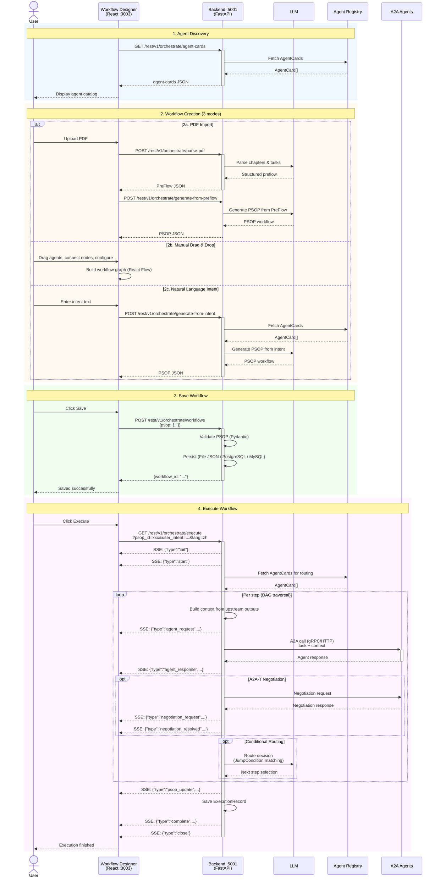
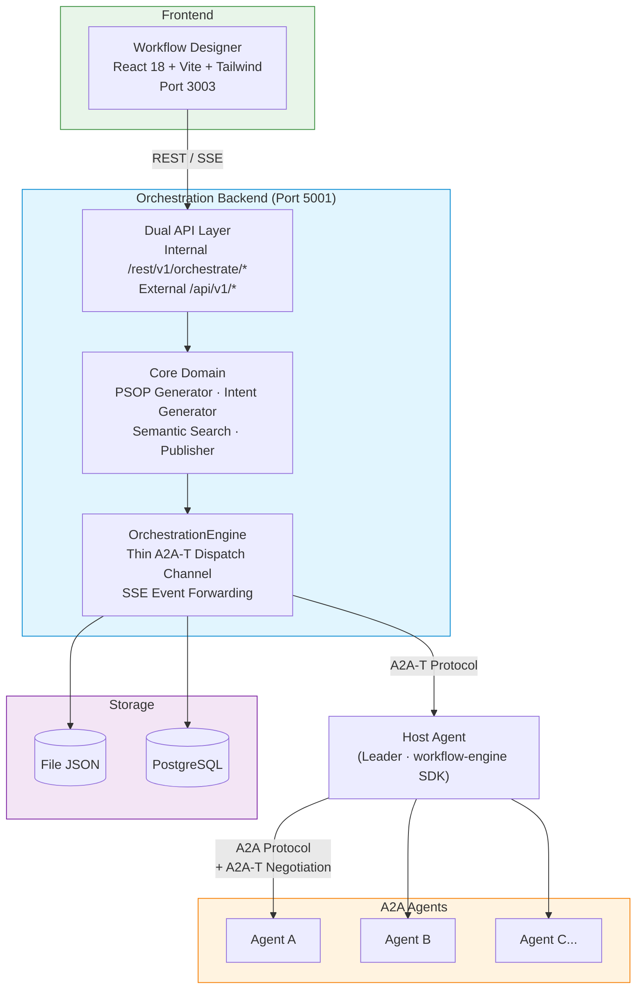

<!--
Copyright (c) 2026 Huawei Technologies Co., Ltd.
All Rights Reserved.

SPDX-License-Identifier: Apache-2.0

   Licensed under the Apache License, Version 2.0 (the "License"); you may
   not use this file except in compliance with the License. You may obtain
   a copy of the License at

        http://www.apache.org/licenses/LICENSE-2.0

   Unless required by applicable law or agreed to in writing, software
   distributed under the License is distributed on an "AS IS" BASIS, WITHOUT
   WARRANTIES OR CONDITIONS OF ANY KIND, either express or implied. See the
   License for the specific language governing permissions and limitations
   under the License.
-->

# A2A-T Multi-Agent Orchestration Center

<p align="center">
  <a href="https://www.python.org/"></a>
  <a href="https://nodejs.org/"></a>
  <a href="LICENSE"></a>
</p>

<p align="center">
  <strong>A visual orchestration platform for multi-agent collaboration via the A2A-T protocol.</strong>
  <br>
  基于 A2A-T 协议的多智能体可视化编排平台。
</p>

<p align="center">
  <a href="./README_zh.md">中文</a>
</p>

---

## Overview

The Orchestration Center is a visual platform for designing and executing multi-agent workflows. It provides a **drag-and-drop workflow designer**, an **async execution engine**, and **A2A-T negotiation** integration — enabling teams to build, manage, and run complex agent collaboration flows without writing code.

**Use cases:** Telecom network assurance workflows, RAN energy-saving orchestration, SPN fault handling pipelines, enterprise multi-agent automation.


```mermaid
sequenceDiagram
    actor User as User
    participant FE as Workflow Designer<br/>(React :3003)
    participant BE as Backend :5001<br/>(FastAPI)
    participant LLM as LLM
    participant Reg as Agent Registry
    participant Agt as A2A Agents

    rect rgb(240, 248, 255)
        Note over User, Reg: 1. Agent Discovery
        FE->>+BE: GET /rest/v1/orchestrate/agent-cards
        BE->>Reg: Fetch AgentCards
        Reg-->>BE: AgentCard[]
        BE-->>-FE: agent-cards JSON
        FE-->>User: Display agent catalog
    end

    rect rgb(255, 250, 240)
        Note over User, Reg: 2. Workflow Creation (3 modes)
        alt 2a. PDF Import
            User->>FE: Upload PDF
            FE->>+BE: POST /rest/v1/orchestrate/parse-pdf
            BE->>LLM: Parse chapters & tasks
            LLM-->>BE: Structured preflow
            BE-->>-FE: PreFlow JSON
            FE->>BE: POST /rest/v1/orchestrate/generate-from-preflow
            BE->>LLM: Generate PSOP from PreFlow
            LLM-->>BE: PSOP workflow
            BE-->>FE: PSOP JSON
        else 2b. Manual Drag & Drop
            User->>FE: Drag agents, connect nodes, configure
            FE->>FE: Build workflow graph (React Flow)
        else 2c. Natural Language Intent
            User->>FE: Enter intent text
            FE->>+BE: POST /rest/v1/orchestrate/generate-from-intent
            BE->>Reg: Fetch AgentCards
            Reg-->>BE: AgentCard[]
            BE->>LLM: Generate PSOP from intent
            LLM-->>BE: PSOP workflow
            BE-->>-FE: PSOP JSON
        end
    end

    rect rgb(240, 255, 240)
        Note over User, Reg: 3. Save Workflow
        User->>FE: Click Save
        FE->>+BE: POST /rest/v1/orchestrate/workflows<br/>{psop: {...}}
        BE->>BE: Validate PSOP (Pydantic)
        BE->>BE: Persist (File JSON / PostgreSQL / MySQL)
        BE-->>-FE: {workflow_id: "..."}
        FE-->>User: Saved successfully
    end

    rect rgb(255, 245, 255)
        Note over User, Agt: 4. Execute Workflow
        User->>FE: Click Execute
        FE->>+BE: GET /rest/v1/orchestrate/execute<br/>?psop_id=xxx&user_intent=...&lang=zh
        BE-->>FE: SSE: {"type":"init"}
        BE-->>FE: SSE: {"type":"start"}
        BE->>Reg: Fetch AgentCards for routing
        Reg-->>BE: AgentCard[]
        loop Per step (DAG traversal)
            BE->>BE: Build context from upstream outputs
            BE-->>FE: SSE: {"type":"agent_request",...}
            BE->>+Agt: A2A call (gRPC/HTTP)<br/>task + context
            Agt-->>-BE: Agent response
            BE-->>FE: SSE: {"type":"agent_response",...}
            opt A2A-T Negotiation
                BE->>Agt: Negotiation request
                Agt-->>BE: Negotiation response
                BE-->>FE: SSE: {"type":"negotiation_request",...}
                BE-->>FE: SSE: {"type":"negotiation_resolved",...}
            end
            opt Conditional Routing
                BE->>LLM: Route decision<br/>(JumpCondition matching)
                LLM-->>BE: Next step selection
            end
        end
        BE-->>FE: SSE: {"type":"psop_update",...}
        BE->>BE: Save ExecutionRecord
        BE-->>FE: SSE: {"type":"complete",...}
        BE-->>-FE: SSE: {"type":"close"}
        FE-->>User: Execution finished
    end
```

## Features

| Category | Capability |
|----------|------------|
| **Visual Designer** | React Flow-based drag-and-drop workflow builder with automatic Dagre layout |
| **Multi-Mode Creation** | PDF document import, manual drag-and-drop, and natural-language-to-workflow via LLM |
| **A2A-T Negotiation** | Workflow-engine coordinates task identity and exchange lifecycle; host callbacks use current A2A-T content generation and validation APIs |
| **Execution Engine** | `OrchestrationEngine` — thin A2A-T dispatch channel; PSOP workflow execution delegated to the Host Agent via workflow-engine SDK |
| **Semantic Search** | Natural-language retrieval of previously built workflows |
| **Dual API Layer** | Internal API (`/rest/v1/orchestrate/*`) for the frontend + External API (`/api/v1/*`) for third-party integration |
| **SSE Streaming** | Real-time execution progress via 11 event types (init, start, agent_request, agent_response, psop_update, negotiation_request, negotiation_resolved, negotiation_failed, complete, error, close) |
| **Pluggable Storage** | File-based JSON, PostgreSQL or MySQL persistence via HandlerRegistry |
| **Template Marketplace** | Pre-built workflow templates for telecom scenarios (live broadcast, energy saving, fault handling) |
| **Sample Agents** | 3 sample A2A agents (Host Agent + two SPN domain agents) for testing and demonstration |

MySQL setup, storage boundaries and container instructions: [MySQL persistence](docs/en/MySQL%20Persistence.md).

## Quick Start

### Prerequisites

| Component | Requirement |
|-----------|-------------|
| Python | 3.12+ |
| Node.js | 20.19+ |

### Install & Run

```bash
# Clone the repository
git clone https://github.com/project-openan/orchestration-center.git
cd orchestration-center

# Backend setup
python3 -m venv .venv
source .venv/bin/activate      # Linux
# .venv\Scripts\activate       # Windows
pip install -r requirements.txt

# The backend refuses to start without a credential unless it is explicitly
# told this is a local demo -- see "Fail-closed startup" below.
python generate_access_password.py      # writes access_password into etc/conf/server.conf
# (alternative, no login at all, loopback only: security.dev_insecure_mode=true)

# Start backend (port 5001)
python -m orchestrate.start

# Frontend setup (separate terminal)
cd workflow-designer
npm install --force
npm run dev                     # port 3003

# (Optional) Start sample agents
cd ..
python -m samples.start_agents_server
```

### Verify

| Service | Check |
|---------|-------|
| Backend | `Uvicorn running on http://127.0.0.1:5001` |
| Frontend | Open `http://localhost:3003` in browser |
| Sample Agents | Agent startup messages in console |

## Docker Deployment

Orchestration Center is one of three OpenAN components meant to run together
(`orchestration-center`, [`registry-center`](https://github.com/hw-irc-sni/registry-center),
[`prompt-registry`](https://github.com/hw-irc-sni/prompt-registry)), sharing
the `openan-net` Docker network so agent cards resolve by container name.

**One-time setup** (once for all three components, not per-repo):
```bash
docker network create openan-net
```

**Production** — `docker-compose.yml` only:
```bash
docker compose up -d --build
```
Talks to registry-center over HTTPS at `https://openan-registry-center:5000`
(registry-center is HTTPS-by-default in production — see its README). Start
registry-center's stack first, or this container will log connection errors
until that hostname resolves and answers.

This also brings up `workflow-designer`, the containerized frontend: a
multi-stage build (`npm run build`, served by nginx) exposed at
`http://localhost:3003`. nginx reverse-proxies `/api/orchestrate/` to the
`orchestration-center` service on the compose network (matching the
`defaultGateway` the frontend's `src/service/api.js` defaults to), so the
browser never needs a direct route to port 5001 -- keeping frontend and
backend on the same origin, which the session cookie (see Authentication
below) requires. Override the upstream with `BACKEND_HOST`/`BACKEND_PORT`
env vars if you rename or repoint the backend service.

**Development** — layers `docker-compose-dev.yml` on top, which switches
`AGENT_REGISTRY_URL` to plain HTTP to match registry-center's dev stack
(HTTPS disabled there — see that repo's `docker-compose-dev.yml`), and also
brings up a `sample-agents` service (the stub demo agents from
`samples/agentcard/*.json`) so workflow execution has something to call:
```bash
docker compose -f docker-compose.yml -f docker-compose-dev.yml up -d --build
```
`sample-agents` runs the same image with `python3 -m samples.start_agents_server`
and `SAMPLE_AGENTS_HOST=sample-agents`, which makes it advertise and register
its cards under that Compose service name instead of the `127.0.0.1` baked
into the JSON files (only correct when both processes share a host, which
containers don't). It's dev-only and intentionally absent from
`docker-compose.yml` — these are stub agents, not production backends.

> Don't run this `sample-agents` container and a host-run
> `python -m samples.start_agents_server` (`bin/start_samples.sh`) against the
> same registry at the same time — each registers its own card URLs
> (`sample-agents:PORT` vs `127.0.0.1:PORT`) and whichever started last wins,
> silently breaking calls from the other.

Negotiation-capable sample agents need a real chat model to do anything past
startup. Give them a `chat` entry in `etc/config/models.yaml` (or point
`LLM_CONFIG_HOST_FILE` at a shared one) and put the secret it names — such as
`LLM_CHAT_API_KEY` — in the `.env` next to the compose file. Without both, the
containers start green but negotiation fails.

Every value in `environment:` reads from the host shell (or a `.env` file
next to the compose file) first, falling back to the default shown in the
file — e.g. `AGENT_REGISTRY_URL=https://a-different-host:5000 docker compose up -d`
overrides it without editing the file.

> Keep the two components on the same "track" — both production files
> together, or both dev files together. Mixing a production
> `registry-center` (HTTPS) with a dev `orchestration-center` pointed at
> `http://` (or vice versa) will fail the TLS handshake.

`prompt-registry` has no wiring to the other two today — join it to
`openan-net` for future integration, but it can be started independently in
any order.

## Architecture


```mermaid
flowchart TB
    subgraph frontend["Frontend"]
        wd["Workflow Designer<br/>React 18 + Vite + Tailwind<br/>Port 3003"]
    end

    subgraph backend["Orchestration Backend (Port 5001)"]
        direction TB
        api["Dual API Layer<br/>Internal /rest/v1/orchestrate/*<br/>External /api/v1/*"]
        domain["Core Domain<br/>PSOP Generator · Intent Generator<br/>Semantic Search · Publisher"]
        engine["OrchestrationEngine<br/>Thin A2A-T Dispatch Channel<br/>SSE Event Forwarding"]
    end

    subgraph storage["Storage"]
        direction LR
        file[("File JSON")]
        pg[("PostgreSQL")]
    end

    subgraph agents["A2A Agents"]
        direction LR
        a1["Agent A"]
        a2["Agent B"]
        a3["Agent C..."]
    end

    wd -->|"REST / SSE"| api
    api --> domain
    domain --> engine
    engine --> file
    engine --> pg
    engine -->|"A2A-T Protocol"| wb["Host Agent<br/>(Leader · workflow-engine SDK)"]
    wb -->|"A2A Protocol<br/>+ A2A-T Negotiation"| a1
    wb --> a2
    wb --> a3

    style backend fill:#e1f5fe,stroke:#0288d1
    style frontend fill:#e8f5e9,stroke:#388e3c
    style storage fill:#f3e5f5,stroke:#7b1fa2
    style agents fill:#fff3e0,stroke:#f57c00
```

## API Overview

### External API (`/api/v1/*`)

| Method | Endpoint | Description |
|--------|----------|-------------|
| `POST` | `/api/v1/orchestrate/sop` | SOP-based workflow orchestration (JSON text or file upload) |
| `POST` | `/api/v1/orchestrate/intent` | Intent-based workflow orchestration |
| `GET` | `/api/v1/orchestrate/psop/{id}` | Get PSOP workflow detail |
| `POST` | `/api/v1/orchestrate/search` | Search workflows by natural language intent |
| `POST` | `/api/v1/orchestrate/execute` | Auto-orchestrate + execute (SSE streaming) |
| `GET` | `/api/v1/orchestrate/execute/{id}` | Execute a known PSOP (SSE streaming) |
| `GET` | `/api/v1/executions` | List execution records |
| `GET` | `/api/v1/executions/{id}` | Get execution result |

### Internal API (`/rest/v1/orchestrate/*`)

| Method | Endpoint | Description |
|--------|----------|-------------|
| `GET` | `/workflows` | List workflows |
| `GET` | `/workflows/{id}` | Get workflow detail |
| `POST` | `/workflows` | Create workflow |
| `DELETE` | `/workflows/{id}` | Delete workflow |
| `POST` | `/parse-pdf` | Parse PDF SolutionPackage and extract PreFlow |
| `POST` | `/generate-from-preflow` | Generate PSOP from PreFlow |
| `POST` | `/generate-from-intent` | Generate PSOP from intent |
| `POST` | `/retrieve-by-intent` | Retrieve workflow by intent |
| `POST` | `/retrieve-topn-by-intent` | Retrieve top-N workflows by intent |
| `GET` | `/agent-cards` | List available agent cards |
| `GET` | `/templates` | List workflow templates |
| `POST` | `/templates/{id}/import` | Import workflow from template |
| `GET` | `/execute` | Start workflow execution (SSE). Query params: `psop_id`, `user_intent`, `lang` |
| `GET` | `/execution-records` | List execution records |
| `GET` | `/execution-records/{id}` | Get execution record detail |
| `DELETE` | `/execution-records/{id}` | Delete execution record |
| `POST` | `/sandbox/{workflow_id}/run` | Start an internal sandbox verification |
| `GET` | `/sandbox/verifications` | List sandbox reports |
| `GET` | `/sandbox/verifications/{id}` | Get sandbox status or report |
| `GET` | `/sandbox/verifications/{id}/events` | Get sandbox execution events |
| `DELETE` | `/sandbox/verifications/{id}` | Cancel a run or delete its report |
| `GET` | `/sandbox/templates/{workflow_id}` | Get sandbox stub templates |
| `PUT` | `/sandbox/templates/{workflow_id}` | Save sandbox stub templates |

Full API specification: [API Reference](docs/en/Orchestration%20Center%20API%20Reference.md)

### Host Agent Runtime

`host_agent` provides the workflow execution host. It runs as an independent A2A Agent process, invokes the Workflow Engine, wraps execution events, and manages the process lifecycle. Business decisions are injected through ControlPoint implementations; the sample SPN policy is provided by `samples/spn_host_agent`. Start it with:

```bash
python -m samples.start_agents_server
```

The Orchestration Center owns persisted PSOP data. When the UI dispatches a workflow, it passes a PSOP snapshot to the Host Agent in A2A metadata; direct intent execution falls back to the configured workflow repository.

### Sandbox Verification

Sandbox verification is separate from formal execution:

1. **Static checks** validate DAG structure, `context_from` ancestry, Agent/Skill matching, and Task-T/Negotiation-T declarations.
2. **Stub execution** runs the real Workflow Engine scheduling path but replaces remote A2A calls with locally generated Stub responses.
3. **Reports** record pass/warning/fail checks, execution path, context trace, Stub interactions, risks, and suggestions.
4. **Editor snapshots** allow unsaved or imported workflows to be verified. A valid `psop` snapshot in the run request takes precedence over loading the workflow by ID.
5. **Report language** follows the `zh` / `en` run request. Backend report text is loaded from `orchestrate/sandbox/locales`.

A sandbox `pass` means workflow structure and engine scheduling were verified with Stub Agents. It does **not** prove that real Agents will produce correct business output.

## Security

The Orchestration Center provides multi-layer access control:

### Frontend Login (Internal API)

The internal API (`/rest/v1/orchestrate/*`) is protected by token-based authentication. Two modes are supported depending on `persistence_mode`:

**Database mode (`persistence_mode=postgresql` or `mysql`)**:

- The plaintext password is sent to the backend over TLS and stored using versioned bcrypt hashes; legacy hashes are upgraded on successful login.
- On an empty SQL user store, set `OC_ADMIN_INITIAL_PASSWORD` or `admin_initial_password_file` to create the first `admin`. No compiled-in password is used; existing users are never reset on restart.
- Self-registration is disabled by default; explicitly set `auth.register.enabled=true` to enable it.
- Passwords must be at least 8 characters and include at least two of: a digit, an uppercase letter, a lowercase letter, a special character. Enforced server-side (`common/util/password_util.validate_password_complexity`), not just in the UI.

**File mode (`persistence_mode=file`)**:
- A single password is configured via `access_password` in `server.conf`.
- Username is fixed as `admin`.
- Registration is not available.

### Fail-closed startup

The external API (`/api/v1/*`) has no application-layer guard -- the auth middleware
covers `/rest/v1/orchestrate` and the `/psops` alias only -- so with `enable_https=false`
those routes have neither mTLS nor a token check. A startup check
(`orchestrate/server/security_preflight.py`) therefore evaluates the deployment before
the server binds:

| `enable_https` | Credential configured | Bind address | Outcome |
|---|---|---|---|
| `true` | any | any | start |
| `false` | yes | any | start, with a warning that the transport is plaintext |
| `false` | no | loopback | start **only** with `security.dev_insecure_mode=true` |
| `false` | no | non-loopback | **refused**, with the two ways to fix it |

The shipped `etc/conf/server.conf` has `enable_https=false` and an empty
`access_password`, and the image defaults (`Dockerfile`,
`docker-compose.yml`) bind `0.0.0.0` -- so a container that is not given a
credential is refused at startup rather than starting open. To run the backend,
pick one of the two ways:

1. **Configure a credential** (required for anything reachable from off-host):
   set `access_password` with `python generate_access_password.py`, or point
   `admin_initial_password_file` at an existing file, or export
   `OC_ADMIN_INITIAL_PASSWORD`. With `enable_https=false` the password and session
   token travel in cleartext, so enable HTTPS for anything but a local run.
2. **Bind a loopback address** (`ip=127.0.0.1`) if the instance is only reachable
   locally. A credential-less loopback bind still needs
   `security.dev_insecure_mode=true`; it disables authentication for every route and
   is meant for local demos. The flag is echoed by `GET /health` so an instance
   started this way is visible from outside, and an audit entry is written at startup.

`security.dev_insecure_mode=true` does **not** lift the refusal for a non-loopback
bind -- there the exposure is real regardless of who set the flag.

### Sample Agent Credentials

The bundled sample agents authenticate against **localhost-only demo endpoints** using platform factory-default credentials committed in `samples/agent_credentials.json`. This file exists so the demo topology works out of the box; it is read by the sample agents, not by the orchestration backend.

For anything beyond the local demo, do not reuse these defaults:
- Point the process at an external, protected credentials file via the `ORCH_AGENT_CREDENTIALS_FILE` environment variable (or the `agent_credentials_file` config key), or
- Keep the file layout but store encrypted values: any value prefixed with `enc:` is decrypted with the AES-GCM key in `A2AT_CRED_KEY` (provided by the workflow-engine SDK's credential crypto).

| Config Key | Description | Default |
|------------|-------------|---------|
| `access_password` | SHA-256 hash of the login password (file mode only). **Empty means authentication is unconfigured, not disabled**: a startup check refuses to bind a non-loopback address with no credential while `enable_https=false` — see [Fail-closed startup](#fail-closed-startup). | empty (unconfigured) |
| `security.dev_insecure_mode` | Local-demo exception to that check: permits a credential-less bind **only** on a loopback address. Authentication is genuinely off while it is set, so an audit entry is written at startup and `GET /health` echoes the flag. | `false` |
| `access_token_ttl` | Session token lifetime in seconds. | `43200` (12h) |
| `persistence_mode` | `postgresql` or `mysql` enables database-backed user management; `file` uses config-based auth. | `file` |

The frontend sends the password as-is; the backend is what hashes it (server-side, salted, for DB-mode accounts; against the configured SHA-256 in file mode). **This relies on `enable_https=true` for confidentiality in transit** -- see the TLS/HTTPS section below; don't run with the shipped `enable_https=false` default outside local development. The session token is a `Secure` (when `enable_https=true`), `HttpOnly`, `SameSite=Lax` cookie set on login -- it's not readable from JavaScript (mitigates XSS token theft) and the browser attaches it automatically, including on `EventSource`/SSE connections, so it's never carried in a URL or logged as a query param. `Authorization: Bearer <token>` is also accepted as a fallback for non-browser clients (curl, scripts).

A cookie only attaches to a **same-origin** request. Both shipped serving paths -- nginx in front of both in docker-compose, and the Vite dev server's own `/api/orchestrate` proxy for `npm run dev` -- put the frontend and this API on the same origin, so this is transparent. A manually-configured direct-IP deployment (frontend and backend on genuinely different origins) needs `CORS_ORIGINS` set to the frontend's exact origin (not the default `*`, which can't be combined with credentialed requests) for the cookie to work cross-origin at all.

> **Session storage is single-process only.** Tokens live in an in-memory dict inside the running Python process. Running with multiple `uvicorn` workers, or multiple replicas behind a load balancer, will intermittently reject valid tokens -- a token minted by one worker isn't visible to another. Every process restart also logs out all active sessions (harmless in itself given the token TTL, but worth expecting). Both bundled launch paths (`orchestrate/start.py`) run single-process today, so this doesn't bite out of the box -- but if multi-worker or multi-replica deployment is ever needed, session storage must move to a shared backend (e.g. the same PostgreSQL database, or Redis) first.

Generate the password hash (file mode):
```bash
python generate_access_password.py
```

### TLS/HTTPS

| Config Key | Description |
|------------|-------------|
| `enable_https` | Enable HTTPS for the backend server. |
| `verify_client` | Require client certificate (mTLS). Defaults to required when unset or set to anything other than the literal `false`; only an explicit `verify_client=false` in `server.conf` disables it. |
| `ssl_certfile` | Server certificate path. |
| `ssl_keyfile` | Server private key path (encrypted). |
| `ssl_ca_certs` | CA trust store for verifying client certificates. |
| `client_verify_server` | Verify remote server certs on outbound HTTPS calls (e.g., to registry center). Default `false` for backward compat. |

Generate self-signed certificates (RSA 3072, compliant with cert validator):
```bash
python -m generate_selfsign_cert etc/ssl serverAuth
```

New TLS certificates include SANs for `DNS:localhost`, `IP:127.0.0.1` and `IP:::1` by default.
For other endpoints, repeat `--dns` / `--ip` for the actual client-facing names; explicit options replace the default SAN list:

```bash
python -m generate_selfsign_cert etc/ssl-new serverAuth --dns orch.example.test --ip 192.0.2.10
```

SANs must match the host in the client URL; IP addresses require `--ip`. Setting CN or trusting a certificate does not fix missing SANs.
Existing certificates are not updated automatically, and the tool refuses to overwrite certificates or private keys.
For an existing deployment, generate into a new directory, back up and deploy the matching certificate/key pair, then restart.
Update client trust material where required; do not overwrite the CA store used to authenticate clients.
`dataSigning` does not add TLS SANs and rejects CLI SAN options.

**Enabling HTTPS (step by step):**

1. Generate certificates (see above). For `serverAuth` the script already writes the deployment
   files expected by `server.conf` (`server.cer`, `trust.cer`, `server_key.pem`, `cert_pwd`);
   add `--plain-key` to also get the unencrypted `server_key_nopass.pem` for nginx. No manual
   copying or password file creation is needed. The fallback password path is also
   `etc/ssl/cert_pwd`. Existing raw/deployment files and client credentials are never overwritten.
   `cert_pwd` is plaintext: protect the entire directory (service-account ACLs on Windows).

2. Update `etc/conf/server.conf`:
   ```ini
   enable_https=true
   verify_client=true           # mTLS -- clients must present a certificate. Set to
                                 # false only if you understand this leaves the
                                 # external API (see below) with no authentication.
   agent_registry_url=https://127.0.0.1:5000   # if registry center also uses HTTPS
   ```

3. Set `client_verify_server=false` in `etc/conf/server.conf` to skip remote cert verification when connecting to other services with self-signed certs (e.g., registry center).

4. Restart the backend: `python -m orchestrate.start` (or `systemctl restart orchestration-center`)

5. If using Nginx as reverse proxy, update `proxy_pass` to `https://127.0.0.1:5001/` and add `proxy_ssl_verify off;`. Nginx needs an unencrypted private key:
   ```bash
   openssl rsa -in etc/ssl/server_key.pem -out etc/ssl/nginx_key.pem -passin pass:<your-password>
   ```
   Then in nginx.conf: `ssl_certificate_key /path/to/etc/ssl/nginx_key.pem;`

### External API Protection

The external API (`/api/v1/*`) is protected by mTLS at the TLS layer when `enable_https=true` and `verify_client=true`. Clients must present a valid certificate during the TLS handshake -- no application-layer check needed.

**With the shipped `enable_https=false` default, the external API has no protection at all** -- no mTLS (there's no TLS layer to begin with) and no application-layer check (`auth_middleware` only guards the internal API, `/rest/v1/orchestrate/*`, by design). Anything reachable on the network can call it. Don't expose a default (HTTP) deployment beyond local development without a reverse proxy, firewall, or network policy in front of it -- and once you do enable HTTPS, leave `verify_client` at its secure default (`true`) unless you have another authentication layer in place.

### Auth Endpoints

| Method | Endpoint | Description |
|--------|----------|-------------|
| `POST` | `/rest/v1/orchestrate/auth/login` | Login with username + password, sets the session cookie |
| `POST` | `/rest/v1/orchestrate/auth/register` | Register a new user (PostgreSQL/MySQL mode only) |
| `POST` | `/rest/v1/orchestrate/auth/logout` | Revoke the session token and clear its cookie |
| `GET` | `/rest/v1/orchestrate/auth/check` | Check if auth is required, token validity, and registration availability |
| `GET` | `/rest/v1/orchestrate/auth/users` | List all users (PostgreSQL/MySQL mode only) |
| `DELETE` | `/rest/v1/orchestrate/auth/users/{username}` | Delete a user (admin cannot be deleted) |

## Configuration

| Config File | Purpose |
|-------------|---------|
| `etc/conf/server.conf` | Server IP, port, TLS certificates, persistence mode, registry URL, access password, `client_verify_server` |
| `etc/conf/server.properties` | TLS ciphers, rate limiting, connection limits |
| `etc/conf/db/postgresql.json` | PostgreSQL connection settings — gitignored; copy `etc/conf/db/postgresql.json.template` to get started (only needed for `persistence_mode=postgresql`) |
| `etc/conf/db/mysql.json` | MySQL connection settings — gitignored; copy its `.template`, inject `MYSQL_PASSWORD`, or use environment-only configuration; see [MySQL persistence](docs/en/MySQL%20Persistence.md) |
| `.env` | Local model settings and A2A-T SDK settings — gitignored; production should inject secrets through its environment |
| `etc/config/README_en.md` | LLM configuration guide |
| `generate_selfsign_cert.py` | Self-signed certificate generator (RSA 3072) |
| `workflow_engine.client.ssl_context` | Client-side SSL context factory for outbound HTTPS (provided by the workflow-engine SDK) |

## LLM configuration

Built-in `openai_compatible` (`openai` alias) and `aoc_signed` profiles supply request/response contracts.
Model definitions live in the gitignored `etc/config/models.yaml`; only
secrets come from the process environment or the repo-root `.env`:

```yaml
models:
  chat:
    provider: openai_compatible
    model: your-model
    url: https://provider.example/v1/chat/completions
    api_key_env: LLM_CHAT_API_KEY
```

```dotenv
LLM_CHAT_API_KEY=your-secret
```

The keys under `models:` are the enabled capabilities — `chat`, `embed` and
`rerank` are the built-in ones, and any other name works once a registered
profile supports it. `model` and `url` are required; `provider` defaults to
`openai`. For AOC signing set `provider: aoc_signed` and reference
`app_key_env` / `app_secret_env` under `auth:`, plus any service-specific
fields. `timeout`, `verify_ssl` and `enable_thinking` are optional. A reference
to an unset variable fails the load, and a literal secret in the file is
rejected. `LLM_CONFIG_FILE` selects a different model file, while
`docker-compose.yml` mounts one through `LLM_CONFIG_HOST_FILE`. Process
environment variables take precedence over `.env`. Changes take effect after
process restart.

Protocol contracts are registered in `common/llm/config/model_sources.py`;
adding a new model using an existing protocol needs only configuration, while
a new protocol requires a profile and its tests. `A2AT_LLM_*` remains an
independent SDK configuration.

`api_key_env` is optional for keyless local endpoints. Run
`python -m scripts.migrate_llm_config` if settings are still in `.env`, or
`python -m scripts.migrate_legacy_llm_json` if they are still in the old JSON.

This configures the orchestration backend's own LLM calls (intent parsing, PSOP retrieval, PDF
summarization). It is independent of the A2A-T negotiation SDK's configuration below.

See [`models.yaml.example`](etc/config/models.yaml.example) and
[`.env.example`](.env.example) for DeepSeek, Qwen and self-hosted-gateway examples.

## A2A-T SDK Integration

This project integrates the workflow-engine SDK for Host Agent workflow execution and agent
fulfillment negotiation. Its configuration (`A2AT_LLM_PROVIDER`, `A2AT_LLM_MODEL`,
`A2AT_LLM_API_KEY`, `A2AT_LLM_BASE_URL`, …) is read directly
from the repo-root `.env` — set it there:

```bash
A2AT_LLM_PROVIDER=openai
A2AT_LLM_MODEL=deepseek-chat
A2AT_LLM_API_KEY=<your-api-key>
A2AT_LLM_BASE_URL=https://api.deepseek.com
```

`A2AT_LLM_PROVIDER` selects the SDK's LLM client, not the model vendor — the endpoint is whatever
`A2AT_LLM_BASE_URL` points at. Keep it at `openai`: the SDK registers that name in every process,
while other names (such as `deepseek`) are registered only inside the orchestration-center backend
and make the sample agents fail with `Unknown llm provider`.

This is independent of the `LLM_CHAT_*` configuration above — there is no auto-derivation between
the two.

The workflow engine does not initialize the retired A2A-T negotiation state machine. Host code uses the current content generation and validation APIs and returns final protocol content through its callbacks.

## Documentation

| Document | Description |
|----------|-------------|
| [User Guide](docs/en/Orchestration%20Center%20User%20Guide.md) | Features, scenarios, quick start, FAQ |
| [API Reference](docs/en/Orchestration%20Center%20API%20Reference.md) | Full REST API specification |
| [Developer Guide](docs/en/Orchestration%20Center%20Development%20Guide.md) | Custom handlers, LLM module, extension |
| [GCP Deployment Guide](docs/en/Orchestration%20Center%20GCP%20Containerized%20Deployment%20Guide.md) | Docker + GCP Cloud Run deployment guide |
| [Frontend README](workflow-designer/README.md) | Workflow Designer setup and tech stack |
| [LLM Config](etc/config/README_en.md) | LLM configuration reference |

> For Chinese documentation, see [中文 README](README_zh.md) or [docs/zh/](docs/zh/).

## License

This project is licensed under the **Apache License 2.0**. See [LICENSE](LICENSE) for details.


数据库连接统一使用 `etc/conf/db/` 模板，密码由 `.env` / 环境变量引用；参见 [Database configuration / 数据库配置](docs/database-configuration.md)。旧连接配置不再作为运行时来源。
