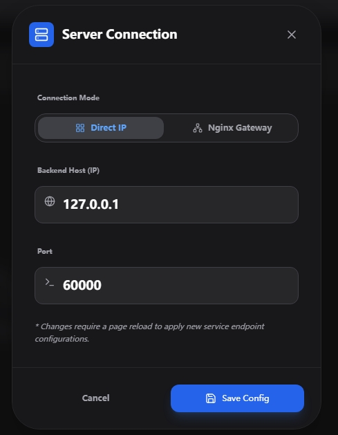

# 编排中心功能简介

编排中心是一个面向多智能体（Agent）协作的可视化编排平台，支持通过图形化工作流设计器定义 Agent 之间的调用关系与执行流程。后端基于 Python 框架解析流程并驱动 Agent 协同工作，主要功能包括：

- **PSOP 管理**：支持工作流（PSOP）的列表查看、详情查询、保存与删除操作。
- **PDF 解析**：提供 PDF 文件内容解析能力，为后续流程设计提供数据支持。
- **智能规划**：根据用户需求自动生成工作流规划，降低编排门槛。
- **Agent 管理**：获取全量 AgentCard 列表，便于了解可用能力与调用方式。
- **自然语言生成 PSOP**：通过自然语言意图直接生成可执行的编排流程。
- **意图检索 PSOP**：根据自然语言描述，检索匹配的历史工作流。
- **实时流程执行**：支持以流式方式启动 PSOP 执行，并实时推送运行进展，便于监控与调试。

通过这些功能，编排中心帮助用户高效构建、管理和运行复杂的 Agent 协作流程。

# 组件交互接口定义

### 1. PDF解析接口
- `POST /parse-pdf` - 上传PDF文件并解析

### 2. 工作流规划接口
- `POST /plan` - 提交任务和步骤，获取规划结果

### 3. PSOP管理接口
- `GET /psops` - 获取PSOP列表
- `GET /psops/<workflow_id>` - 根据ID获取PSOP详情
- `POST /psops` - 保存PSOP
- `DELETE /psops/<workflow_id>` - 删除PSOP

### 4. AgentCard管理接口
- `GET /agent-cards` - 获取全量AgentCard列表

### 5. 意图生成接口
- `POST /generate-from-intent` - 根据自然语言意图生成PSOP
- `POST /retrieve-by-intent` - 根据自然语言意图检索PSOP

### 6. SSE执行接口
- `GET /rest/start_process_stream?psop_id=<id>` - 启动PSOP执行并推送实时进展

---

## 接口详情

### 1. PDF解析接口

#### `POST /parse-pdf`

上传PDF文件并解析"5. Interaction Flow"章节。

**请求**:
- **方法**: POST
- **Content-Type**: multipart/form-data

**参数**:
| 参数名 | 类型 | 必填 | 描述 |
|--------|------|------|------|
| file | file | 是 | PDF文件 |

**响应**:
```json
{
  "status": "success",
  "message": "PDF文件解析成功",
  "content": "PreFlow JSON数据"
}
```

**错误响应**:
- 400: 未提供文件、文件名为空、非PDF文件
- 400: PDF解析失败，未找到指定章节
- 500: 解析失败

---

### 2. 工作流规划接口

#### `POST /plan`

提交任务和步骤，获取规划结果。

**请求**:
- **方法**: POST
- **Content-Type**: application/json

**请求体**:
```json
{
  "preflow": {
    "name": "工作流名称",
    "description": "工作流描述",
    "steps_md": "Markdown格式的步骤描述"
  },
  "agent_cards": [
    {
        "name": "TestAgent",
        "description": "这是一个TestAgent",
        "version": "1.0.0",
        "provider": {
            "organization": "AI Solutions Inc.",
            "url": "https://test.example.com"
        },
        "skills": [
            {
                "name": "Test1",
                "description": "Test1"
            },
            {
                "name": "Test2",
                "description": "Test2"
            }
        ],
        "capabilities": {
            "streaming": true,
            "push_notifications": false,
            "extensions": []
        },
        "default_input_modes": ["text", "json"],
        "default_output_modes": ["text", "json"],
        "supported_interfaces": [
            {
                "protocol_binding": "GPRC",
                "protocol_version": "1.0.0",
                "url": "http://127.0.0.1:5000/"
            },{
                "protocol_binding": "HTTP+JSON",
                "protocol_version": "1.0.0",
                "url": "http://127.0.0.1:5000/"
            }
        ]
    }
  ]
}
```

**响应**:
```json
{
  "status": "success",
  "data": "PSOP工作流JSON数据"
}
```

**错误响应**:
- 400: 请求体为空
- 400: 缺少必要字段
- 500: 规划失败

---

### 3. PSOP管理接口

#### 3.1 `GET /psops`

获取所有PSOP的列表。

**请求**:
- **方法**: GET

**查询参数**:
| 参数名 | 类型 | 必填 | 默认值 | 描述 |
|--------|------|------|--------|------|
| limit | integer | 否 | 10 | 返回结果数量限制 |
| workflow_type | string | 否 | "psop" | 工作流类型，可选值: "all", "psop", "preflow" |

**响应**:
```json
{
  "status": "success",
  "count": 2,
  "data": [
    {
      "workflow_id": "test-psop-001",
      "workflow_type": "psop",
      "name": "能源节约分析流程",
      "description": "用于分析能源使用情况的PSOP",
      "tags": ["energy", "analysis", "automation"],
      "created_at": "2026-03-18T18:18:26.264191",
      "score": 1.0
    }
  ]
}
```

#### 3.2 `GET /psops/<workflow_id>`

根据ID获取单个PSOP的完整详情。

**请求**:
- **方法**: GET

**路径参数**:
| 参数名 | 类型 | 必填 | 描述 |
|--------|------|------|------|
| workflow_id | string | 是 | PSOP的唯一标识符 |

**响应**:
```json
{
  "status": "success",
  "data": {
    "id": "test-psop-001",
    "name": "能源节约分析流程",
    "description": "用于分析能源使用情况的PSOP",
    "created_at": "2026-03-18T18:18:26.264191",
    "steps": [
      {
        "name": "数据收集",
        "type": "AllSuccess",
        "subtasks": [
          {
            "description": "收集能源使用数据",
            "agent": "data-collector",
            "skill": "data-collection",
            "status": "pending"
          }
        ],
        "next": null
      }
    ],
    "related_preflow": null,
    "user_intent": null,
    "tags": ["energy", "analysis", "automation"]
  }
}
```

#### 3.3 `POST /psops`

保存PSOP到存储系统。

**请求**:
- **方法**: POST
- **Content-Type**: application/json

**请求体**:
PSOP的JSON数据，必须符合PSOP模型定义。

PSOP模型定义
```python
class PSOP(BaseModel):
    id: str = Field(default_factory=lambda: str(uuid4()),
                    description="Unique workflow identifier (auto-generated if not provided)")
    name: str = Field(..., description="Workflow name", examples=['energy_saving_process', 'fault_diagnosis_process'])
    description: Optional[str] = Field(None, description="Brief work description, empty by default")
    created_at: datetime = Field(default_factory=datetime.now, description="Creation timestamp")
    steps: List[Step] = Field(..., description="List of steps in the agent collaboration workflow")
    related_preflow: Optional[str] = Field(None,
                                           description="Associated Preflow ID that this PSOP was generated from")
    user_intent: Optional[str] = Field(None,
                                       description="Original user intent that generated this workflow")
    tags: Optional[List[str]] = Field(default_factory=list, description="Tags for quick filtering")
```

Step模型定义
```python
class Step(BaseModel):
    name: str = Field(..., description="Step identifier", examples=['step1', 'step2'])
    type: StepType = Field(StepType.ALL_SUCCESS,
                           description="Step success condition")
    subtasks: List[Task] = Field(..., description="List of subtasks within the step")
    next: Optional[List[JumpCondition]] = Field(None,
                                                description="Jump conditions to next steps")
```

**响应**:
```json
{
  "status": "success",
  "message": "PSOP保存成功",
  "workflow_id": "test-psop-003"
}
```

#### 3.4 `DELETE /psops/<workflow_id>`

删除指定ID的PSOP工作流。

**请求**:
- **方法**: DELETE

**路径参数**:
| 参数名 | 类型 | 必填 | 描述 |
|--------|------|------|------|
| workflow_id | string | 是 | PSOP的唯一标识符 |

**响应**:
**成功响应 (200 OK):**
```json
{
  "status": "success",
  "message": "PSOP test-psop-001 删除成功"
}
```

**错误响应 (404 Not Found):**
```json
{
  "error": "未找到ID为 test-psop-999 的PSOP"
}
```

**错误响应 (500 Internal Server Error):**
```json
{
  "error": "删除PSOP失败: 文件可能不存在"
}
```
---

### 4. AgentCard管理接口

#### `GET /agent-cards`

获取全量AgentCard列表。

**请求**:
- **方法**: GET

**响应**:
```json
{
  "status": "success",
  "count": 1,
  "data": [
    {
        "name": "TestAgent",
        "description": "这是一个TestAgent",
        "version": "1.0.0",
        "provider": {
            "organization": "AI Solutions Inc.",
            "url": "https://test.example.com"
        },
        "skills": [
            {
                "name": "Test1",
                "description": "Test1"
            },
            {
                "name": "Test2",
                "description": "Test2"
            }
        ],
        "capabilities": {
            "streaming": true,
            "push_notifications": false,
            "extensions": []
        },
        "default_input_modes": ["text", "json"],
        "default_output_modes": ["text", "json"],
        "supported_interfaces": [
            {
                "protocol_binding": "GPRC",
                "protocol_version": "1.0.0",
                "url": "http://127.0.0.1:5000/"
            },{
                "protocol_binding": "HTTP+JSON",
                "protocol_version": "1.0.0",
                "url": "http://127.0.0.1:5000/"
            }
        ]
    }
  ]
}
```

---

### 5. 意图生成接口

#### 5.1 `POST /generate-from-intent`

根据自然语言意图生成PSOP工作流。

**请求**:
- **方法**: POST
- **Content-Type**: application/json

**请求体**:
```json
{
  "user_intent": "自然语言描述的业务意图",
  "workflow_name": "可选的工作流名称"
}
```

**响应**:
```json
{
  "status": "success",
  "message": "PSOP生成成功",
  "data": {
    "id": "psop-uuid",
    "name": "PSOP名称",
    "description": "PSOP描述",
    "steps": [...],
    "tags": [...],
    "created_at": "2024-01-01T00:00:00"
  }
}
```

#### 5.2 `POST /retrieve-by-intent`

根据自然语言意图检索最合适的PSOP工作流。

**请求**:
- **方法**: POST
- **Content-Type**: application/json

**请求体**:
```json
{
  "user_intent": "自然语言描述的业务意图"
}
```

**响应**:
找到匹配的PSOP:
```json
{
  "status": "success",
  "message": "PSOP检索成功",
  "data": {
    "id": "psop-uuid",
    "name": "PSOP名称",
    "description": "PSOP描述",
    "steps": [...],
    "tags": [...],
    "created_at": "2024-01-01T00:00:00"
  }
}
```

未找到匹配的PSOP:
```json
{
  "status": "success",
  "message": "未找到匹配的PSOP",
  "data": null
}
```

---

### 6. SSE执行接口

#### `GET /rest/start_process_stream`

启动PSOP工作流执行，并通过Server-Sent Events (SSE) 实时推送执行进度和事件到前端。

**请求**:
- **方法**: GET
- **Content-Type**: text/event-stream

**查询参数**:
| 参数名 | 类型 | 必填 | 说明 |
|--------|------|------|------|
| psop_id | string | 是 | 要执行的PSOP工作流ID |

**响应格式**:
SSE事件流，每个事件格式如下：
```
data: {"type": "事件类型", "data": {事件数据}, "timestamp": 时间戳}
```

**事件类型**:
1. **init** - 初始化事件
2. **start** - 开始执行事件
3. **agent_request** - Agent请求事件
4. **agent_response** - Agent响应事件
5. **psop_update** - PSOP状态更新事件
6. **complete** - 完成事件
7. **error** - 错误事件
8. **close** - 关闭事件

**示例事件**:
```json
{
  "type": "agent_request",
  "data": {
    "agent": "RAN Energy Saving Agent",
    "request": "{\"contextId\": null, \"extensions\": null, \"kind\": \"message\", \"messageId\": \"73d37d27-7cd7-4b70-a099-8ec90aef1858\", \"metadata\": null, \"parts\": [{\"kind\": \"text\", \"metadata\": null, \"text\": \"获取包含目标最佳可能值的RAN节能探索报告\"}], \"referenceTaskIds\": null, \"role\": \"user\", \"taskId\": null}"
  },
  "timestamp": 1234567890.789
}
```

# 界面使用说明
## 前提条件
1. 启动注册中心服务：UI界面展示的所有Agent信息均是从注册中心获取的（具体操作见注册中心的用户指南或快速入门）
2. 启动编排中心服务： 编排中心前端UI与编排中心后台有交互，所以也需要启动（具体操作见编排中心的快速入门）
### 环境要求
- Node.js 20.19

## 启动方式
### 方式一：
进入{安装目录}/workflow-designer目录下，执行`npm install --force`命令
等待所有依赖下载完成，执行`npm run dev`

如果想查看demo，需要额外启动samples目录下的`start_agents_server.py`脚本(注册中心默认没有注册Agent，该脚本时向注册中心注册了几个Agent并启动对应的Agent)
进入到项目{安装目录}，执行命令
```bash
python -m samples.start_agents_server
```
### 方式二：
进入项目目录下的`bin`文件夹
```bash
cd {安装目录}/orchestration-center/bin
``` 
执行脚本文件（该脚本文件会自动启动前端服务和samples下的脚本）：
```bash
./start_samples.sh
```
### 访问应用
上述步骤启动成功后，可以通过下面的方式进行访问。
1. 打开浏览器访问 http://localhost:3003
2. 使用工作流设计器创建和编辑流程图
3. 通过 API 接口管理 PSOP 工作流

## 界面功能介绍
进入编排中心界面后，首先点击界面右上角的齿轮状图标，修改ip为编排中心实际的安装环境ip，修改端口为编排中心实际监听的端口，保存即可。

### Agent库：

左侧展示所有Agent，可以通过Agent名称或者功能进行搜索；点击某个Agent，右侧展示该Agent详情


### 编排中心：

左侧展示目前所有的psop，上方可以通过名称进行搜索，点击左侧某个psop后，右侧会展示该psop详情。


点击左侧上方那个"+",右侧会展示编排psop的几种方式，目前有三种：


第一种：导入pdf格式文件生成对应的psop
第二种：手动编排
可以通过拖动下方的Agent卡片到画布上，然后连线，点击连线，可以设置跳转条件

第三种：输入一段自然语言，后台会根据用户的输入和目前所有的Agent自动取编排

### 工作流执行
上方输入框先输入用户意图，点击右侧的“检索工作流”按钮，如果检索到，左侧会显示该posp，中间部门会显示该psop对应的工作流，点击左侧psop右侧的“▶”按钮，页面右侧会实时显示工作流的执行过程。


